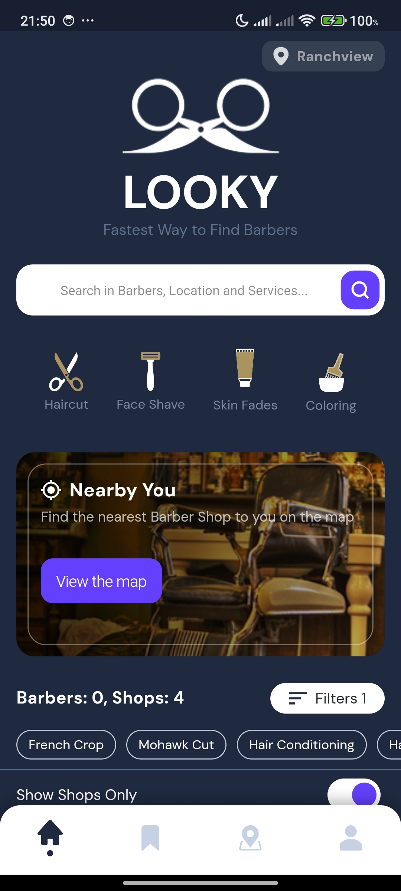
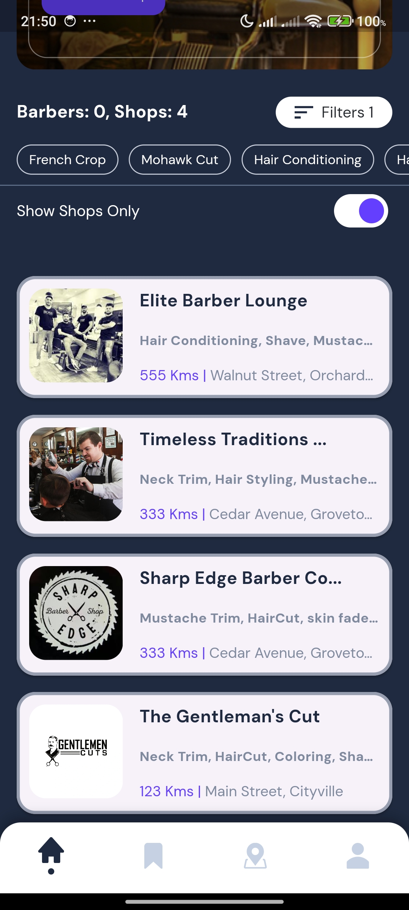
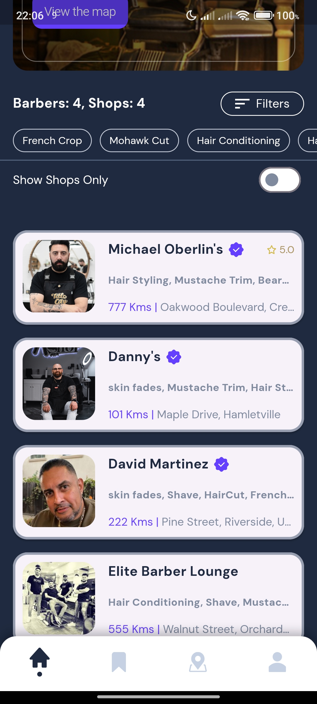

# LOOKY - Barber Finder App

A Flutter mobile application that helps users find nearby barbers and barber shops with advanced filtering capabilities.

## Features

- **Barber & Shop Directory**: Browse through a list of barbers and barber shops
- **Service Filtering**: Filter professionals by the services they offer
- **Shop/Individual Filtering**: Toggle between viewing shops only or all professionals
- **Responsive UI**: Clean, modern interface with custom styling
- **Offline Support**: Cache data for offline viewing
- **Pull-to-Refresh**: Update listings with latest data

## Screenshots

<p float="left">
  
  
  
</p>

## Design

The UI/UX design for this application is available on Figma:
[LOOKY App Design.](https://www.figma.com/file/RTqzLefF74Yg6cqNbIwEWP/Untitled?type=design&mode=design&t=Dqx6RAjPZQ9C5efv-0)

## Architecture

This project follows **Clean Architecture** principles with:

- **Domain Layer**: Business logic and entities
- **Data Layer**: Repository implementations, data sources
- **Presentation Layer**: UI components, cubits for state management

### State Management

The app uses the BLoC pattern via [flutter_bloc](https://pub.dev/packages/flutter_bloc) with:
- `ServiceCubit` for managing service data and filtering
- `BarberCubit` for managing barber listings and applying filters

### Dependency Injection

Dependency injection is handled with [get_it](https://pub.dev/packages/get_it) in the `injection.dart` file.

## Getting Started

### Prerequisites
- Flutter SDK (latest stable version)
- Dart SDK

### Installation
1. Clone this repository
2. Run `flutter pub get` to install dependencies
3. Run `flutter run` to start the application

## Project Structure
```
lib/
├── core/
│   ├── api/            # API handling and exceptions
│   ├── network/        # Network connectivity
│   ├── theme/          # App theme definitions
│   └── widgets/        # Shared widgets
├── features/
│   ├── barber/         # Barber listing feature
│   ├── navigation/     # Bottom navigation
│   └── services/       # Service filtering feature
└── injection.dart      # Dependency injection setup
```


## Contribution Guide
<p>Please fork the repository and open a pull request to submit your contributions. You can find more details in the <a href="CONTRIBUTING.md">Contribution Guide</a>.</p>

## License

LOOKY is released under the [MIT License](LICENSE).

---

## Release

### Version 1.0.0
- **Initial Release**: First public release of LOOKY Barber Finder App.
- **Features**:
  - Core functionality for finding barbers and shops.
  - Advanced filtering options for services and shop types.
  - Responsive and modern UI design.
- **Download**: [LOOKY Release V1.0.0](https://github.com/amin-khademi/LOOKY/releases/tag/V1.0.0)
